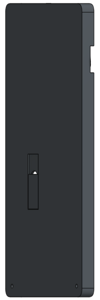

# ∇Calc / NablaCalc

**A dedicated scientific calculator with a physical 7×7 keyboard, ESP32-S3, local storage, 2.2-inch SPI display and a bonus OV5640 camera for capturing equations.**


> **Project stage:** complete virtual hardware design prepared for prototype funding. The `PCB` board, enclosure CAD and base firmware exist; physical operation is not claimed until the first funded prototype is assembled and tested.

## Why I built it

Cell phones can solve equations, but they’re distracting and aren’t really math tools or anything like that. The ∇Calc explores a different product: a real handheld scientific calculator with physical keys, adding modern features only when requested. Its camera stays protected behind a mechanical cover and is meant for occasional equation/OCR capture, not continuous recording. Camera setups designed for other recording applications heat up and need a proper cooling system, maybe some space—usually a dissipation pad. Here, that’s not necessary.

The goal of the design is a compact, manufacturable device, with electronics, power path, camera interface, keyboard, and casing designed together. And the bonuses and improvements that current technology offers. I’m also thinking of using some kind of TinyModel, more like OCR, to see if I can turn this into an edge IoT device...

## What is included

- Four-layer, **84 × 85 mm** custom main PCB built around an `ESP32-S3-WROOM-1-N16R8`.
- USB-C native data on GPIO19/20, LiPo charging and a `TPS63001` 3.3 V buck-boost supply.
- Physical 7×7 keyboard scanned through an `MCP23017` I2C expander.
- Shared SPI interfaces for the display and microSD storage.
- RAW `OV5640` 5 MP autofocus DVP camera interface with four local rails, SCCB level translation and DVP level shifters.
- A 24-pin, 0.5 mm `FH12-24S-0.5SH(55)` FPC camera connector.
- Parametric enclosure parts, a camera privacy slider and full STEP assemblies. The type of material and membrane will still be better studied and properly structured for the build once we have the components
- ESP-IDF firmware baseline with NVS, I2C and keyboard scanning implemented.

## Virtual design renders

| Calculator assembly | Camera privacy mechanism |
|---|---|
|  |  |

## System architecture

```text
                    USB-C data
                         │
                         ▼
LiPo ─ charger ─ power path ─ TPS63001 ─ 3V3 ─ ESP32-S3
                                                    │
            ┌───────────────────────────────────────┼──────────────────────┐
            │                                       │                      │
          SPI display                          SPI microSD             I2C MCP23017
                                                                         │
                                                                      7×7 keys
                                                    │
                           DVP + SCCB + power sequencing
                                                    │
                                       RAW OV5640 AF camera
```

The camera is powered only when needed. Its raw sensor rails are generated on the main PCB (`2.8 V`, `1.5 V` and autofocus supply), while level translators protect the 3.3 V ESP32-S3 interface.

## First build / prices

I am going with the JLC Top PCBA because I do not have experience soldering the
small parts myself. Their minimum gives me five boards and two Top assemblies.
I will do the Bottom side later.

| Item | Price (USD) |
|---|---:|
| JLC Top PCBA: 5 PCBs + 2 Top assemblies, with the ESP32-S3 | 86.18 |
| Bottom components for the two boards | 4.43 |
| Battery, camera, display, FPC cables and screws | 24.51 |
| **Funding request, without shipping or taxes** | **115.12** |

Shipping and taxes are not included. The parts list, links and price evidence
are in [external parts](hardware/procurement/NablaCalc_External_Parts.csv).

I will decide the keyboard contact material, microSD and case printing after I
have the real modules in hand. If I decide to solder everything myself instead,
the other option is about US$45.12.

## Repository map

```text
hardware/
  pcb/                  current fabrication files, EasyEDA source and PCB model
  procurement/          external parts and purchase-status list
  archive/               historical exports; not for manufacturing
  assets/               project artwork
mechanical/
  onshape_exports/      enclosure pieces and complete assemblies
  reference_parts/      display reference models
firmware/
  nabla_firmware/       current ESP-IDF firmware
docs/                   submission and reviewer documentation
```

Start with:

- [Complete purchase BOM](BOM.csv)
- [JLC/LCSC-only PCB component BOM](hardware/procurement/NablaCalc_JLC_LCSC_Only_BOM.csv)
- [External parts list](hardware/procurement/NablaCalc_External_Parts.csv)
- [Editable EasyEDA PCB source](hardware/pcb/source/NablaCalc_PCB.epro2)
- [Editable EasyEDA schematic source](hardware/pcb/source/NablaCalc_Schematic.epro2)
- [Current 2.2-inch-display mechanical assembly](mechanical/onshape_exports/NablaCalc_Assembly_2.2in_Display.step)
- [Earlier complete mechanical assembly](mechanical/onshape_exports/NablaCalc_Assembly_Legacy.step)
- [ESP32-S3 pin map](firmware/nabla_firmware/main/board_pins.h)
- [Main firmware entry point](firmware/nabla_firmware/main/nabla_firmware.c)

## Camera selected for the prototype

The intended external sensor is the **RAW OV5640 5 MP autofocus, 24-pin DVP version with the `68D lens` option and approximately 78 mm FPC**:

- [Camera listing on AliExpress](https://www.aliexpress.com/item/1005006858943975.html)

The project does **not** use a MIPI-only variant, an ESP32-CAM replacement module or the older Arducam B0158 breakout. The seller pinout and contact orientation must be checked against `FPC1` once more before purchase.

## Firmware build

The firmware targets ESP-IDF 6.x and ESP32-S3:

```bash
cd firmware/nabla_firmware
idf.py set-target esp32s3
idf.py build
idf.py -p /dev/ttyACM0 flash monitor
```

A clean build should be generated again after installing the ESP-IDF Python environment and before flashing the first PCBA.

## Some things still to do

- I still need to build and test the real prototype. For now this is the full virtual design for funding.
- The 2.2-inch display is the one I am getting. I will adjust the case better when I have the real parts here. Some old 2.4-inch files are still in the repo history.
- OCR and AI solving are ideas for later, after the calculator itself is working.

## Credits

NablaCalc uses the ESP32-S3 platform and is designed around components and documentation from Espressif, Texas Instruments, Microchip, OmniVision, Hirose and the open-source ESP32 camera ecosystem. Ideas, general research, documentation, and a bit of engineering for the project were developed with AI.
